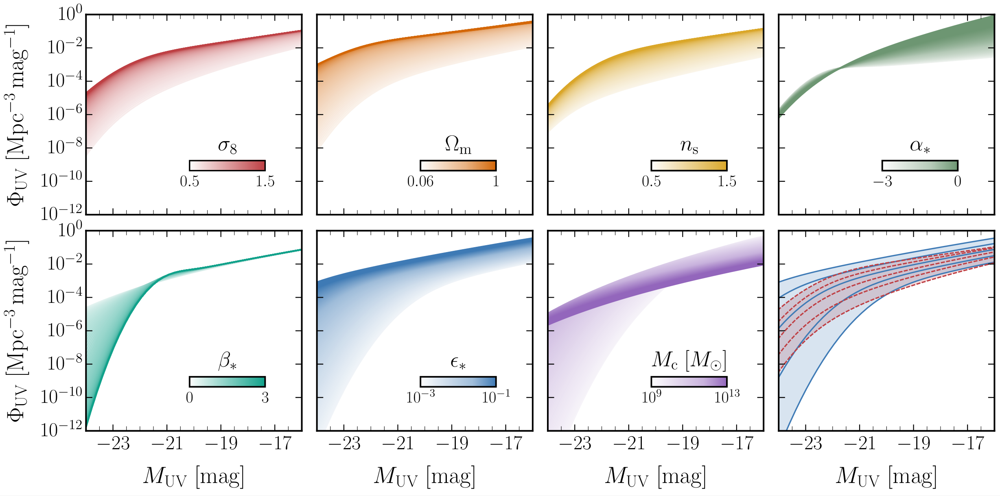

# GALLUMI: A Galaxy Luminosity Function Pipeline for Cosmology and Astrophysics

Authors: Nashwan Sabti, Julian Muñoz and Diego Blas

> A detailed manual and an automated script to move files will appear on this page very soon! 

GALLUMI is a likelihood code that allows to extract cosmological and astrophysical parameters from the UV galaxy luminosity function. The code is implemented in the MCMC sampler [MontePython] and can be readily run in conjunction with other likelihood codes. Details of the code are provided in 2110.XXXX and 2110.XXXX.

This GitHub page contains 1) the GALLUMI likelihood code, 2) scripts to generate mock data, and 3) script to create plots.

## Basic Usage of GALLUMI

- Download the [MontePython] MCMC sampler. 
- Move the contents of MontePython_files to the MontePython folder. 
    - MontePython_files/Bestfits, MontePython_files/Covmats and MontePython_files/Param_files go in the main MontePython folder
    - Create a new folder called "UVLF" in MontePython/data/ and move the contents of MontePython_files/Data/ in there
    - Move the contents of MontePython_files/Likelihoods/ to MontePython/montepython/likelihoods/
- Run the likelihood code with e.g. 
    ```sh 
    python2 montepython/MontePython.py run --conf default.conf --param Param_files/UVLF_HST_ST_model1.param --bestfit Bestfits/UVLF_HST_ST_model1.bestfit --covmat Covmats/UVLF_HST_ST_model1.covmat -f 0.5 --output UVLF_HST_ST_model1
    ``` 
## Example Plot
All plots in the papers 2110.XXXX and 2110.XXXX can be reproduced using the scripts provided in the Scripts/Plotting/ folder.



## Using GALLUMI in Publications
If you make use of the GALLUMI code in your publication, please cite the papers 2110.XXXX and 2110.XXXX.
Chains are available upon request. 

## Contact
Please email nashwan.sabti@kcl.ac.uk for any questions :)


[MontePython]: <https://github.com/brinckmann/montepython_public>